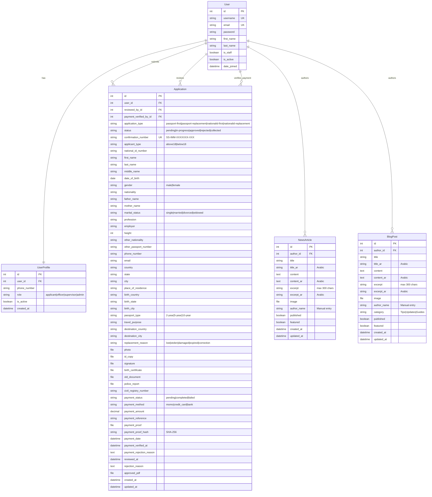
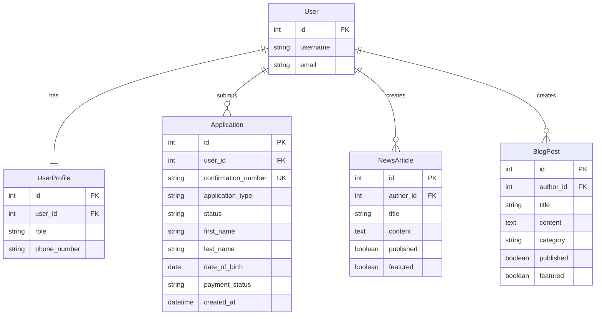

# South Sudan Immigration Portal - EER Diagram (Mermaid)

## Option 1: Mermaid.js (Recommended - Works in GitHub, VS Code, many tools)

### How to Use:
1. **GitHub**: Paste in README.md or any .md file
2. **Mermaid Live Editor**: https://mermaid.live/
3. **VS Code**: Install "Markdown Preview Mermaid Support" extension
4. **Draw.io**: Import → Advanced → Mermaid

### Copy the code below:

---

## How to Generate the Diagram:

### Method 1: Mermaid Live Editor (Easiest)
1. Go to: https://mermaid.live/
2. Paste the code above
3. Click "Download PNG" or "Download SVG"
4. Done! ✅

### Method 2: VS Code
1. Install extension: "Markdown Preview Mermaid Support"
2. Create a .md file and paste the code
3. Press `Ctrl+Shift+V` to preview
4. Right-click → "Export to PNG/SVG"

### Method 3: GitHub
1. Create a README.md in your repo
2. Paste the code
3. GitHub automatically renders it
4. Take a screenshot

### Method 4: Draw.io (diagrams.net)
1. Go to: https://app.diagrams.net/
2. File → Import from → Advanced → Mermaid
3. Paste the code
4. Edit and export

---

## Relationship Legend:

- `||--||` : One-to-One (exactly one)
- `||--o{` : One-to-Many (one to zero or more)
- `}o--o{` : Many-to-Many (zero or more to zero or more)
- `PK` : Primary Key
- `FK` : Foreign Key
- `UK` : Unique Key

---

## Notes:

1. **Mermaid is the most popular** because it's:
   - Free and open-source
   - Works in GitHub, GitLab, VS Code
   - Easy to version control (it's just text)
   - Automatically renders in many platforms

2. **The diagram shows**:
   - All entities (tables)
   - All relationships
   - Key attributes
   - Data types
   - Constraints (PK, FK, UK)

3. **For a more detailed view**, you can add more attributes or split into multiple diagrams.

---

## Alternative: Simplified Version (if too complex)

This simplified version is easier to read and understand at a glance!
