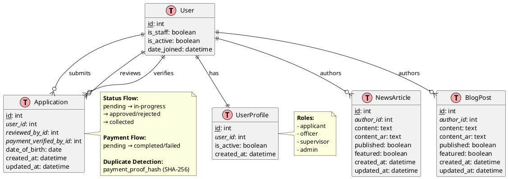
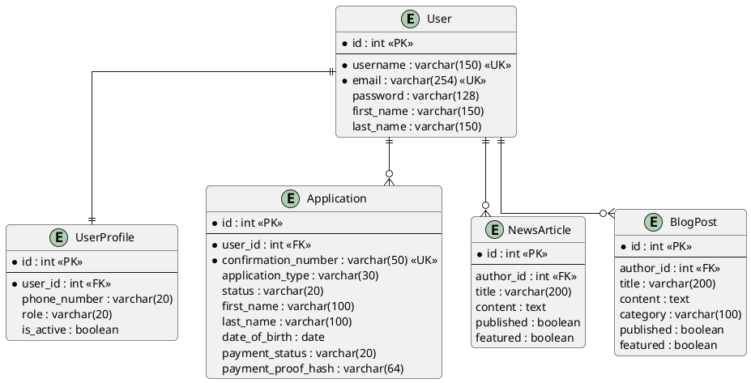

# South Sudan Immigration Portal - EER Diagram (PlantUML)

## Option 2: PlantUML (Professional diagrams)

### How to Use:
1. **PlantUML Online**: http://www.plantuml.com/plantuml/uml/
2. **VS Code**: Install "PlantUML" extension
3. **IntelliJ IDEA**: Built-in support
4. **Eclipse**: Install PlantUML plugin

### Copy the code below:



---

## How to Generate:

### Method 1: PlantUML Online Server
1. Go to: http://www.plantuml.com/plantuml/uml/
2. Paste the code
3. Click "Submit"
4. Download PNG/SVG

### Method 2: VS Code
1. Install "PlantUML" extension
2. Create a .puml file
3. Paste the code
4. Press `Alt+D` to preview
5. Right-click → Export

### Method 3: Command Line (if you have Java)
```bash
# Install PlantUML
brew install plantuml  # Mac
# or download from https://plantuml.com/download

# Generate diagram
plantuml diagram.puml
```

---

## Simplified Version (Cleaner):



---

## Advantages of PlantUML:

1. ✅ Professional-looking diagrams
2. ✅ Highly customizable
3. ✅ Supports many diagram types
4. ✅ Version control friendly (text-based)
5. ✅ Widely used in enterprise
6. ✅ Can generate multiple formats (PNG, SVG, PDF)

---

## Tips:

- Use `skinparam` to customize colors and styles
- Use `note` to add explanations
- Use `hide` to simplify the diagram
- Use `!define` for reusable styles
